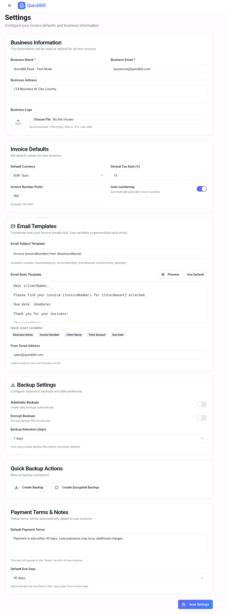

# QuickBill Desk - Application Screenshots

## 📱 User Interface Overview

### Dashboard & Analytics
| Dashboard Light | Dashboard Dark | Admin Dashboard |
|----------------|----------------|-----------------|
|  |  |  |

### Invoice Management
| Create Invoice | Invoice History | PDF Output |
|----------------|-----------------|-------------|
|  |  |  |

### Client Management
| Client List | Create Client |
|-------------|---------------|
|  |  |

### Authentication & Settings
| Login Page | Settings Page | Full Settings |
|------------|---------------|---------------|
|  |  |  |

---

## 🎯 Key Features Showcased

- **Professional Dashboard** - Revenue analytics and business insights
- **Invoice Creation** - Step-by-step invoice builder with live preview
- **Client Management** - Complete CRM with search and filtering
- **Bulk Operations** - Mass actions for efficiency
- **PDF Generation** - Professional invoice output
- **Responsive Design** - Works on all devices
- **Dark/Light Mode** - User preference support

*All screenshots from the production-ready QuickBill Desk application*
