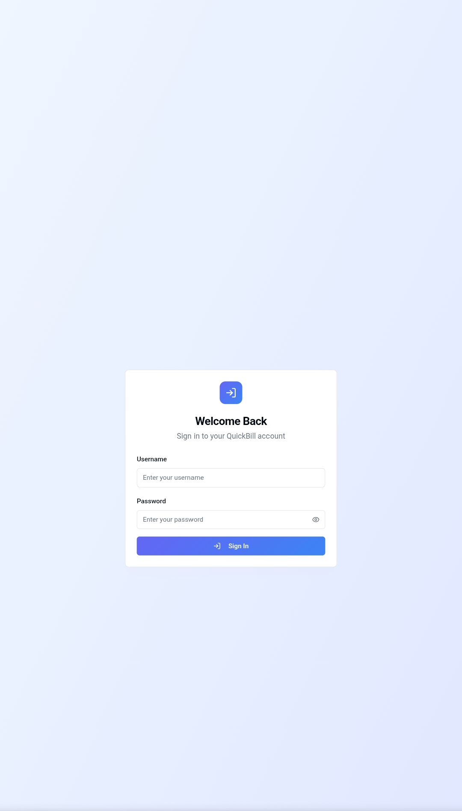

# QuickBill Desk - Application Screenshots

## 📱 User Interface Overview

### Dashboard & Analytics
| Admin Dashboard A | Admin Dashboard B | Admin Dashboard C |
|------------------|------------------|------------------|
|  |  |  |

| Dashboard Light | Dashboard Dark | Bulk Operations |
|-----------------|----------------|-----------------|
|  |  |  |

### Client Management
| Client List | Add Client Form |
|-------------|-----------------|
|  |  |

### Invoice Management
| Create Invoice | Invoice History |
|----------------|-----------------|
|  |  |

### Authentication & Settings
| Login Page | Settings Page |
|------------|---------------|
|  |  |

### PDF Output
| Professional Invoice PDF |
|--------------------------|
|  |

---

## 🎯 Key Features Showcased

- **Professional Dashboard** - Revenue analytics and business insights (3 admin views)
- **Invoice Creation** - Step-by-step invoice builder with live preview  
- **Client Management** - Complete CRM with search and filtering
- **Bulk Operations** - Mass actions for efficiency
- **PDF Generation** - Professional invoice output
- **Responsive Design** - Works on all devices
- **Dark/Light Mode** - User preference support

*All screenshots from the production-ready QuickBill Desk application*
